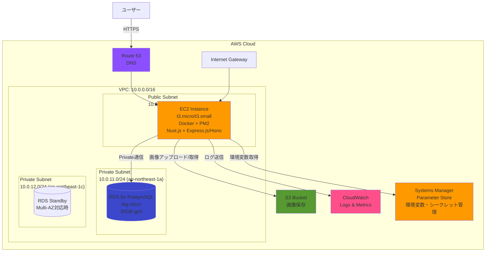

# 本番インフラアーキテクチャ

## 概要

本ドキュメントでは、My Family Tree Appの本番環境におけるインフラアーキテクチャを定義します。

### 設計思想

1. **最小構成からスタート**: 初期コストを抑え、トラフィック増加に応じて段階的にスケーリング
2. **保守性重視**: PM2統合運用を継続し、シンプルなデプロイメントを実現
3. **開発環境との整合性**: 開発環境（Docker + PostgreSQL）との技術スタック統一
4. **AWS無料枠の活用**: 初期運用コストを最小化
5. **将来への拡張性**: コンテナ化により、ECS Fargateへの移行パスを確保

### 本番環境の目的

- 個人利用の家系図管理アプリケーションのホスティング
- 安定稼働とデータの永続化
- 画像ファイルの安全な保存
- 月次運用コスト $20-30以内での運用

## アーキテクチャ構成図



## AWSサービス選定と理由

### 1. アプリケーションホスティング: EC2 (t3.micro / t3.small)

#### 選定理由

| 項目 | 理由 |
|------|------|
| **最小構成** | 初期コストを抑え、シンプルな構成でスタート |
| **PM2統合運用** | 開発環境で構築済みのPM2管理をそのまま活用可能 |
| **Docker活用** | 既存のDocker構成（apps + db）をEC2上で継続運用 |
| **無料枠活用** | t3.micro: 12ヶ月間750時間/月無料（新規AWSアカウント） |
| **柔軟性** | インスタンスタイプの変更が容易（トラフィック増加時） |
| **学習コスト低** | EC2はAWSの基本サービスで、学習リソースが豊富 |

#### インスタンス仕様

**初期構成: t3.micro**

- vCPU: 2
- メモリ: 1 GiB
- ネットワークパフォーマンス: 最大5 Gbps
- EBSストレージ: 30GB gp3
- 用途: 個人利用の初期段階

**スケールアップ時: t3.small**

- vCPU: 2
- メモリ: 2 GiB
- ネットワークパフォーマンス: 最大5 Gbps
- 用途: トラフィック増加時

#### デプロイ構成

```
EC2 Instance
├── Docker Engine
│   ├── apps Container
│   │   ├── PM2 (Process Manager)
│   │   │   ├── Nuxt.js (Frontend: Port 3000)
│   │   │   ├── Express.js (Backend: Port 4000)
│   │   │   └── Hono (Backend: Port 4001)
│   │   └── Node.js 20
│   └── PostgreSQL Client Tools (migration用)
└── CloudWatch Agent (ログ送信)
```

#### セキュリティグループ設定

**インバウンドルール**:

| プロトコル | ポート | 送信元 | 用途 |
|----------|--------|--------|------|
| TCP | 80 | 0.0.0.0/0 | HTTP (ALB経由時) |
| TCP | 443 | 0.0.0.0/0 | HTTPS (ALB経由時) |
| TCP | 22 | 管理者IPのみ | SSH接続（管理用） |

**アウトバウンドルール**:

- すべてのトラフィックを許可（RDS接続、S3アクセス、外部API呼び出し）

### 2. データベース: RDS for PostgreSQL (t4g.micro)

#### 選定理由

| 項目 | 理由 |
|------|------|
| **開発環境との整合性** | 開発環境でPostgreSQL 18-alpineを使用 |
| **Drizzle ORM統合** | 既にDrizzle ORMでマイグレーション・スキーマ管理が構築済み |
| **マネージドサービス** | バックアップ、パッチ適用、モニタリングをAWSが自動管理 |
| **無料枠活用** | t4g.micro（ARM Graviton2）: 12ヶ月間750時間/月無料 |
| **移行コストゼロ** | MySQLからの変更不要、開発環境のスキーマをそのまま利用 |

#### インスタンス仕様

**初期構成: db.t4g.micro**

- vCPU: 2 (ARM Graviton2)
- メモリ: 1 GiB
- ストレージ: 20GB gp3
- PostgreSQLバージョン: 16（開発環境は18-alpineだが、RDSは16を推奨）
- Multi-AZ: 無効（初期構成、将来有効化検討）
- バックアップ保持期間: 7日間
- 自動バックアップウィンドウ: 深夜時間帯（例: 03:00-04:00 JST）

#### 接続設定

- **エンドポイント**: RDSエンドポイント（private subnet内）
- **ポート**: 5432
- **データベース名**: 環境構築時に決定
- **認証情報**: Parameter Storeで管理
- **SSL/TLS**: 有効（RDS証明書を使用）

#### セキュリティグループ設定

**インバウンドルール**:

| プロトコル | ポート | 送信元 | 用途 |
|----------|--------|--------|------|
| TCP | 5432 | EC2セキュリティグループ | アプリケーションからの接続 |

**アウトバウンドルール**:

- なし（RDSは外部通信不要）

#### バックアップ戦略

- **自動バックアップ**: 有効（7日間保持）
- **スナップショット**: 手動スナップショットを月次で取得（長期保存用）
- **Point-in-Time Recovery (PITR)**: 有効（5分単位でリストア可能）

### 3. ストレージ: S3 (画像保存)

#### 選定理由

| 項目 | 理由 |
|------|------|
| **スケーラブル** | 容量無制限、トラフィック増加に自動対応 |
| **高可用性** | 99.999999999%（11 9's）の耐久性 |
| **低コスト** | 従量課金、初期段階は数ドル/月 |
| **セキュリティ** | IAMポリシーとバケットポリシーで細かいアクセス制御 |

#### バケット設定

**バケット名**: 環境構築時に決定（グローバルユニークな名前を設定）

**命名規則**: 組織・プロジェクト・用途・環境を組み合わせた形式を推奨

**用途**:

- アプリケーションで使用する画像ファイルの保存
- エクスポートデータの一時保存

**ディレクトリ構成**: アプリケーションの要件に応じて設計

#### アクセス制御

**パブリックアクセス**: ブロック（すべて無効）

**IAMポリシー** (EC2インスタンスロール):

```json
{
  "Version": "2012-10-17",
  "Statement": [
    {
      "Effect": "Allow",
      "Action": [
        "s3:PutObject",
        "s3:GetObject",
        "s3:DeleteObject"
      ],
      "Resource": "arn:aws:s3:::<bucket-name>/*"
    },
    {
      "Effect": "Allow",
      "Action": "s3:ListBucket",
      "Resource": "arn:aws:s3:::<bucket-name>"
    }
  ]
}
```

#### ライフサイクルポリシー

**古いエクスポート画像の自動削除**:

- `exports/` 配下のオブジェクトを90日後に削除
- `profiles/` 配下は削除しない（永続保存）

#### 暗号化

- **サーバー側暗号化**: SSE-S3（AES-256）を有効化
- **転送時の暗号化**: HTTPS強制

### 4. DNS: Route 53

#### 選定理由

| 項目 | 理由 |
|------|------|
| **AWSサービス統合** | EC2、ALBとのシームレスな連携 |
| **高可用性** | 100% SLAの保証 |
| **ヘルスチェック** | エンドポイント監視とフェイルオーバー対応 |

#### 設定

**ホストゾーン**: ドメイン取得後に設定

**Aレコード**:

- 独自ドメイン → EC2 Elastic IP

**将来対応**:

- ALB導入時は、Aレコード（Alias）でALBに切り替え
- CloudFront導入時は、CNAMEレコードを追加

### 5. 監視・ログ: CloudWatch

#### 監視メトリクス

**EC2インスタンス**:

- CPU使用率（閾値: 80%以上でアラート）
- メモリ使用率（CloudWatch Agentで取得、閾値: 80%以上）
- ディスク使用率（閾値: 85%以上）
- ネットワークトラフィック

**RDS**:

- CPU使用率（閾値: 80%以上）
- データベース接続数（閾値: 最大接続数の80%）
- 空きストレージ（閾値: 5GB以下）
- レプリケーション遅延（Multi-AZ時）

**S3**:

- ストレージ使用量
- リクエスト数

#### ログ収集

**CloudWatch Logs** (ロググループ構成):

環境構築時に以下の構造でロググループを作成：

```
/<project>/<environment>/<service>/
├── <application-1>.log (アプリケーションログ)
├── <application-2>.log (アプリケーションログ)
├── <application-3>.log (アプリケーションログ)
└── error.log (エラーログ)
```

**ログ保持期間**: 30日間（コスト最適化）

**アラート設定**:

- エラーログが1分間に10件以上発生した場合、SNS通知

### 6. シークレット管理: AWS Systems Manager Parameter Store

#### 選定理由

| 項目 | 理由 |
|------|------|
| **既存設計の活用** | `docs/04_infrastructure/06_parameter_store_setup.md`で設計済み |
| **無料枠** | 10,000パラメータまで無料（Standard） |
| **IAM統合** | EC2インスタンスロールで安全にアクセス |
| **暗号化** | SecureString型でKMS暗号化 |

#### パラメータ構成

**パラメータ命名規則**: `/<project>/<environment>/<component>/<key>` の形式を使用

**パラメータ例**:

| パラメータパターン | タイプ | 説明 |
|------------------|------|------|
| `/<project>/<env>/db/host` | String | RDSエンドポイント |
| `/<project>/<env>/db/port` | String | データベースポート |
| `/<project>/<env>/db/name` | String | データベース名 |
| `/<project>/<env>/db/username` | SecureString | DB接続ユーザー |
| `/<project>/<env>/db/password` | SecureString | DB接続パスワード |
| `/<project>/<env>/s3/bucket` | String | S3バケット名 |
| `/<project>/<env>/app/secret-key` | SecureString | アプリケーションのシークレットキー |

**EC2起動時のパラメータ取得例**:

```bash
# パラメータ名は実際の環境に応じて設定
export DB_HOST=$(aws ssm get-parameter --name /<project>/<env>/db/host --query 'Parameter.Value' --output text)
export DB_PASSWORD=$(aws ssm get-parameter --name /<project>/<env>/db/password --with-decryption --query 'Parameter.Value' --output text)
```

## ネットワーク設計

### VPC構成

**VPC CIDR**: `10.0.0.0/16`（65,536個のIPアドレス）

**サブネット設計**:

| サブネット種別 | CIDR | AZ | 用途 |
|-------------|------|----|----|
| Public Subnet | 10.0.1.0/24 | ap-northeast-1a | EC2インスタンス配置 |
| Private Subnet (DB) | 10.0.11.0/24 | ap-northeast-1a | RDS Primary |
| Private Subnet (DB) | 10.0.12.0/24 | ap-northeast-1c | RDS Standby（Multi-AZ時） |

**将来拡張時のサブネット**:

| サブネット種別 | CIDR | AZ | 用途 |
|-------------|------|----|----|
| Public Subnet | 10.0.2.0/24 | ap-northeast-1c | Multi-AZ時のEC2配置 |

### ルーティング設計

#### Public Subnet ルートテーブル

| 宛先 | ターゲット | 説明 |
|------|----------|------|
| 10.0.0.0/16 | local | VPC内通信 |
| 0.0.0.0/0 | Internet Gateway | インターネット接続 |

#### Private Subnet ルートテーブル

| 宛先 | ターゲット | 説明 |
|------|----------|------|
| 10.0.0.0/16 | local | VPC内通信 |

**注意**: Private SubnetはInternet Gatewayへのルートなし（外部接続不可）

### セキュリティグループ設計

#### sg-ec2-app（EC2用）

**インバウンド**:

| プロトコル | ポート | 送信元 | 説明 |
|----------|--------|--------|------|
| TCP | 80 | 0.0.0.0/0 | HTTP |
| TCP | 443 | 0.0.0.0/0 | HTTPS |
| TCP | 22 | 管理者IP | SSH（管理用） |

**アウトバウンド**:

- すべて許可（0.0.0.0/0）

#### sg-rds-db（RDS用）

**インバウンド**:

| プロトコル | ポート | 送信元 | 説明 |
|----------|--------|--------|------|
| TCP | 5432 | sg-ec2-app | PostgreSQL接続 |

**アウトバウンド**:

- なし

## セキュリティ設計

### IAMロール設計

#### EC2インスタンスロール

**ロール名**: 環境構築時に決定

**信頼ポリシー**:

```json
{
  "Version": "2012-10-17",
  "Statement": [
    {
      "Effect": "Allow",
      "Principal": {
        "Service": "ec2.amazonaws.com"
      },
      "Action": "sts:AssumeRole"
    }
  ]
}
```

**アタッチするポリシー**:

1. **CloudWatch Logs書き込み**（カスタムポリシー）:
   ```json
   {
     "Version": "2012-10-17",
     "Statement": [
       {
         "Effect": "Allow",
         "Action": [
           "logs:CreateLogGroup",
           "logs:CreateLogStream",
           "logs:PutLogEvents"
         ],
         "Resource": "arn:aws:logs:<region>:<account-id>:log-group:/<project>/<env>/*"
       }
     ]
   }
   ```

2. **Parameter Store読み取り**（カスタムポリシー）:
   ```json
   {
     "Version": "2012-10-17",
     "Statement": [
       {
         "Effect": "Allow",
         "Action": [
           "ssm:GetParameter",
           "ssm:GetParameters",
           "ssm:GetParametersByPath"
         ],
         "Resource": "arn:aws:ssm:<region>:<account-id>:parameter/<project>/<env>/*"
       },
       {
         "Effect": "Allow",
         "Action": "kms:Decrypt",
         "Resource": "arn:aws:kms:<region>:<account-id>:key/*"
       }
     ]
   }
   ```

3. **S3アクセス**（前述のポリシー）

### 暗号化戦略

#### RDS暗号化

- **保管時の暗号化**: 有効（AWS KMS管理のキーを使用）
- **転送時の暗号化**: SSL/TLS接続を強制

#### S3暗号化

- **保管時の暗号化**: SSE-S3（AES-256）
- **転送時の暗号化**: HTTPS接続を強制（バケットポリシーで設定）

**バケットポリシー例**:

```json
{
  "Version": "2012-10-17",
  "Statement": [
    {
      "Effect": "Deny",
      "Principal": "*",
      "Action": "s3:*",
      "Resource": "arn:aws:s3:::<bucket-name>/*",
      "Condition": {
        "Bool": {
          "aws:SecureTransport": "false"
        }
      }
    }
  ]
}
```

#### Parameter Store暗号化

- **SecureString型**: AWS KMS管理のキーで暗号化
- **アクセス制御**: IAMポリシーで限定

### パブリックアクセス管理

- **S3バケット**: パブリックアクセスブロックを有効化
- **RDS**: Private Subnet配置（インターネットからアクセス不可）
- **EC2**: セキュリティグループでポート制限

## 初期構成のコスト試算

### 月次運用コスト（無料枠活用時）

**AWS無料枠（新規アカウント、12ヶ月間）**:

| サービス | 無料枠 | 無料枠適用後の月額 |
|---------|--------|------------------|
| EC2 (t3.micro) | 750時間/月 | $0（無料枠内） |
| RDS (t4g.micro) | 750時間/月 | $0（無料枠内） |
| EBSストレージ (30GB gp3) | 30GB | $0（無料枠内） |
| RDSストレージ (20GB gp3) | 20GB | $0（無料枠内） |
| S3ストレージ | 5GB | $0（無料枠内、画像数百枚まで） |
| データ転送 | 100GB/月 | $0（無料枠内） |
| Route 53（ホストゾーン） | - | $0.50/月 |
| CloudWatch Logs（5GB） | 5GB | $0（無料枠内） |
| **合計** | - | **約$0.50/月** |

### 月次運用コスト（無料枠終了後）

| サービス | 仕様 | 月額 |
|---------|-----|------|
| EC2 (t3.micro) | 1インスタンス（24時間稼働） | $7.50 |
| RDS (t4g.micro) | Single-AZ、20GB gp3 | $12.00 |
| EBSストレージ | 30GB gp3 | $2.40 |
| S3ストレージ | 5GB（画像保存） | $0.12 |
| S3リクエスト | 10,000リクエスト/月 | $0.05 |
| データ転送 | 10GB/月（out） | $0.90 |
| Route 53 | ホストゾーン | $0.50 |
| CloudWatch Logs | 5GB | $2.50 |
| **合計** | - | **約$25.97/月** |

**目標達成**: $20-30/月の範囲内 ✅

### コスト最適化の方針

1. **Reserved Instances検討**（1年後）:
   - EC2、RDSを1年または3年予約で最大75%削減

2. **Savings Plans**:
   - Compute Savings Plansで柔軟なコスト削減

3. **ストレージ最適化**:
   - S3 Intelligent-Tieringで自動的にアクセス頻度に応じたストレージクラス変更

4. **CloudWatch Logs削減**:
   - ログ保持期間を14日間に短縮（コスト削減）
   - 重要ログのみS3にアーカイブ

5. **不要リソースの削除**:
   - 古いEBSスナップショットの定期削除
   - 未使用のElastic IPの解放

## IaCツール選定

### 推奨: AWS CDK (TypeScript)

#### 選定理由

| 項目 | 理由 |
|------|------|
| **TypeScript統合** | プロジェクトの技術スタック（TypeScript）と完全に統一 |
| **プログラマブル** | 条件分岐、ループ、変数を使った柔軟なインフラ定義 |
| **型安全性** | TypeScriptの型チェックでIaCコードの品質向上 |
| **AWSベストプラクティス** | L2/L3コンストラクトで推奨設定が自動適用 |
| **コード再利用** | コンポーネント化でインフラパターンの再利用が容易 |

#### 代替案との比較

| ツール | メリット | デメリット |
|--------|---------|----------|
| **AWS CDK** | TypeScript統合、型安全、プログラマブル | AWSのみ対応 |
| **Terraform** | マルチクラウド対応、豊富なプロバイダー | HCL言語の学習コスト、型安全性なし |
| **CloudFormation** | AWS公式、追加コストなし | JSONまたはYAML記述、冗長、再利用性低 |

#### CDKプロジェクト構成

```
infrastructure/
├── bin/
│   └── <project>-infra.ts (エントリーポイント)
├── lib/
│   ├── network-stack.ts (VPC、サブネット、セキュリティグループ)
│   ├── database-stack.ts (RDS for PostgreSQL)
│   ├── compute-stack.ts (EC2インスタンス)
│   ├── storage-stack.ts (S3バケット)
│   └── monitoring-stack.ts (CloudWatch)
├── cdk.json
└── package.json
```

#### CDK実装例（VPCスタック）

```typescript
import * as cdk from 'aws-cdk-lib';
import * as ec2 from 'aws-cdk-lib/aws-ec2';
import { Construct } from 'constructs';

export class NetworkStack extends cdk.Stack {
  public readonly vpc: ec2.Vpc;

  constructor(scope: Construct, id: string, props?: cdk.StackProps) {
    super(scope, id, props);

    this.vpc = new ec2.Vpc(this, 'AppVPC', {
      ipAddresses: ec2.IpAddresses.cidr('10.0.0.0/16'),
      maxAzs: 2,
      natGateways: 0, // コスト削減（初期構成）
      subnetConfiguration: [
        {
          cidrMask: 24,
          name: 'Public',
          subnetType: ec2.SubnetType.PUBLIC,
        },
        {
          cidrMask: 24,
          name: 'PrivateDB',
          subnetType: ec2.SubnetType.PRIVATE_ISOLATED,
        },
      ],
    });
  }
}
```

## デプロイ戦略

### CI/CDパイプライン（GitHub Actions統合）

#### デプロイフロー

```
GitHub Repository (push to main)
    ↓
GitHub Actions Workflow起動
    ↓
1. ビルド & テスト
   - npm install
   - npm run quality
   - npm run test:frontend
   - npm run test:backend
    ↓
2. Dockerイメージビルド
   - docker build -t <app-name>:latest .
    ↓
3. EC2へデプロイ
   - SSH接続
   - Dockerイメージpull
   - docker-compose up -d --no-deps apps
   - PM2プロセス再起動
    ↓
4. ヘルスチェック
   - アプリケーションのヘルスチェックエンドポイント確認
    ↓
5. CloudWatch Logsで確認
```

#### GitHub Actions設定例

```yaml
name: Deploy to Production

on:
  push:
    branches:
      - main

jobs:
  deploy:
    runs-on: ubuntu-latest

    steps:
      - name: Checkout code
        uses: actions/checkout@v4

      - name: Setup Node.js
        uses: actions/setup-node@v4
        with:
          node-version: '20'

      - name: Install dependencies
        run: npm install

      - name: Run quality checks
        run: npm run quality

      - name: Run tests
        run: |
          npm run test:frontend
          npm run test:backend

      - name: Build Docker image
        run: docker build -t <app-name>:latest .

      - name: Deploy to EC2
        env:
          SSH_PRIVATE_KEY: ${{ secrets.EC2_SSH_KEY }}
          EC2_HOST: ${{ secrets.EC2_HOST }}
        run: |
          echo "$SSH_PRIVATE_KEY" > key.pem
          chmod 600 key.pem
          ssh -i key.pem -o StrictHostKeyChecking=no ec2-user@$EC2_HOST '
            cd /home/ec2-user/<app-directory> &&
            git pull origin main &&
            docker-compose up -d --no-deps apps &&
            docker exec apps pm2 reload all
          '
```

### 手動デプロイ手順（初回構築時）

#### 1. EC2インスタンス初期設定

```bash
# SSHでEC2に接続
ssh -i <key-file>.pem ec2-user@<EC2-PUBLIC-IP>

# 必要なパッケージインストール
sudo yum update -y
sudo yum install -y docker git

# Dockerサービス起動
sudo systemctl start docker
sudo systemctl enable docker
sudo usermod -a -G docker ec2-user

# Docker Composeインストール
sudo curl -L "https://github.com/docker/compose/releases/latest/download/docker-compose-$(uname -s)-$(uname -m)" -o /usr/local/bin/docker-compose
sudo chmod +x /usr/local/bin/docker-compose

# リポジトリクローン
git clone <repository-url>
cd <app-directory>
```

#### 2. Parameter Storeから環境変数取得

```bash
# AWS CLIインストール（EC2インスタンスロールで認証）
sudo yum install -y aws-cli

# 環境変数ファイル作成
cat <<EOF > .env.production
NODE_ENV=production
DB_HOST=$(aws ssm get-parameter --name /<project>/<env>/db/host --query 'Parameter.Value' --output text)
DB_PORT=$(aws ssm get-parameter --name /<project>/<env>/db/port --query 'Parameter.Value' --output text)
DB_NAME=$(aws ssm get-parameter --name /<project>/<env>/db/name --query 'Parameter.Value' --output text)
DB_USER=$(aws ssm get-parameter --name /<project>/<env>/db/username --with-decryption --query 'Parameter.Value' --output text)
DB_PASSWORD=$(aws ssm get-parameter --name /<project>/<env>/db/password --with-decryption --query 'Parameter.Value' --output text)
S3_BUCKET=$(aws ssm get-parameter --name /<project>/<env>/s3/bucket --query 'Parameter.Value' --output text)
EOF
```

#### 3. アプリケーション起動

```bash
# Dockerコンテナ起動
docker-compose --profile production up -d

# マイグレーション実行
docker exec apps npm run db:migrate:prod

# PM2プロセス確認
docker exec apps pm2 list
```

#### 4. CloudWatch Agent設定

```bash
# CloudWatch Agentインストール
sudo yum install -y amazon-cloudwatch-agent

# 設定ファイル作成
sudo tee /opt/aws/amazon-cloudwatch-agent/etc/config.json <<EOF
{
  "logs": {
    "logs_collected": {
      "files": {
        "collect_list": [
          {
            "file_path": "/var/log/pm2/*.log",
            "log_group_name": "/family-tree/prod/ec2",
            "log_stream_name": "{instance_id}"
          }
        ]
      }
    }
  }
}
EOF

# CloudWatch Agent起動
sudo /opt/aws/amazon-cloudwatch-agent/bin/amazon-cloudwatch-agent-ctl \
  -a fetch-config \
  -m ec2 \
  -c file:/opt/aws/amazon-cloudwatch-agent/etc/config.json \
  -s
```

## 監視・ログ戦略

### CloudWatch Alarms設定

#### EC2インスタンスアラート

| メトリクス | 閾値 | アクション |
|----------|------|----------|
| CPUUtilization | 80%以上（5分間） | SNS通知 |
| StatusCheckFailed | 1回以上 | SNS通知 + 自動リカバリー |

#### RDSアラート

| メトリクス | 閾値 | アクション |
|----------|------|----------|
| CPUUtilization | 80%以上（5分間） | SNS通知 |
| DatabaseConnections | 最大接続数の80%以上 | SNS通知 |
| FreeStorageSpace | 5GB以下 | SNS通知 |

#### アプリケーションアラート

| ログパターン | 閾値 | アクション |
|------------|------|----------|
| "ERROR" | 10件/分以上 | SNS通知 |
| "500" | 5件/分以上 | SNS通知 |

### ログ分析

**CloudWatch Logs Insights クエリ例**:

```sql
-- エラーログ集計（過去1時間）
fields @timestamp, @message
| filter @message like /ERROR/
| stats count() by bin(5m)

-- APIレスポンスタイム分析
fields @timestamp, @message
| filter @message like /response_time/
| stats avg(response_time), max(response_time) by bin(1m)
```

## 将来の拡張計画

### Phase 2: 中規模トラフィック対応（100-500ユーザー）

#### アプリケーション層の拡張

1. **Application Load Balancer (ALB)導入**:
   - EC2インスタンスを2つ以上に増やし、ALBで負荷分散
   - ヘルスチェック機能で障害時の自動切り離し
   - SSL/TLS証明書（ACM）の統合

2. **Auto Scaling設定**:
   - CPU使用率70%以上でスケールアウト
   - 最小インスタンス数: 2、最大: 4

#### データベース層の拡張

1. **Multi-AZ構成への移行**:
   - RDS for PostgreSQL（Multi-AZ有効化）
   - 自動フェイルオーバーで高可用性を確保

2. **Read Replica導入**:
   - 読み取り専用レプリカで読み取り負荷を分散

### Phase 3: ECS Fargateへの移行（500ユーザー以上）

#### コンテナオーケストレーション

1. **ECS Fargateクラスター構築**:
   - サーバーレスコンテナ管理（EC2管理不要）
   - タスク定義でPM2統合運用を継続
   - ALBとの統合

2. **ECR（Elastic Container Registry）導入**:
   - Dockerイメージの一元管理
   - CI/CDパイプラインでECRへ自動push

#### コスト比較（Phase 3）

| 構成 | 月額コスト（推定） |
|-----|-----------------|
| ECS Fargate (2タスク常時稼働) | $30-40 |
| RDS Multi-AZ (t4g.small) | $40-50 |
| ALB | $20 |
| 合計 | $90-110/月 |

### Phase 4: マネージドサービスへの移行検討

#### データベース

- **Aurora PostgreSQL Serverless v2**:
  - 自動スケーリング
  - コスト最適化（使用量に応じた課金）

#### フロントエンド

- **CloudFront + S3**:
  - Nuxt.jsを静的生成（SSG）に移行
  - CloudFrontでグローバル配信

#### 認証

- **Amazon Cognito**:
  - ユーザー認証・認可の管理
  - OAuth2.0、SAML統合

## 構築手順の概要

### 次のIssueで詳細実装

本ドキュメントは、インフラ構成の設計と技術選定を完了しました。実際の構築作業は、次のIssueで以下の順序で実施します：

1. **Issue #104（仮）: AWS CDKプロジェクト初期化**
   - CDKプロジェクト作成
   - スタック定義（Network, Database, Compute, Storage）

2. **Issue #105（仮）: VPCとネットワーク構築**
   - VPC、サブネット、セキュリティグループ作成
   - CDKデプロイ実行

3. **Issue #106（仮）: RDS for PostgreSQL構築**
   - RDSインスタンス作成
   - Parameter Storeへの接続情報登録
   - 初期マイグレーション実行

4. **Issue #107（仮）: EC2インスタンス構築とアプリケーションデプロイ**
   - EC2インスタンス起動
   - Docker環境構築
   - アプリケーションデプロイ
   - CloudWatch Agent設定

5. **Issue #108（仮）: S3バケット構築と画像アップロード機能統合**
   - S3バケット作成
   - IAMポリシー設定
   - アプリケーションからのS3接続テスト

6. **Issue #109（仮）: CI/CDパイプライン構築**
   - GitHub Actions設定
   - 自動デプロイフロー構築

7. **Issue #110（仮）: 監視・アラート設定**
   - CloudWatch Alarms設定
   - SNS通知設定

## まとめ

本ドキュメントでは、My Family Tree Appの本番インフラアーキテクチャとして、以下を選定・設計しました：

### 選定サービス

| カテゴリ | サービス | 理由 |
|---------|---------|------|
| アプリケーション | **EC2 (t3.micro/t3.small)** | 最小構成、PM2統合運用、無料枠活用 |
| データベース | **RDS for PostgreSQL (t4g.micro)** | 開発環境との整合性、Drizzle ORM統合 |
| ストレージ | **S3** | スケーラブル、低コスト、高可用性 |
| DNS | **Route 53** | AWS統合、高可用性 |
| 監視・ログ | **CloudWatch** | AWS統合、アラート設定 |
| シークレット管理 | **Parameter Store** | 既存設計活用、無料枠 |
| IaCツール | **AWS CDK (TypeScript)** | TypeScript統合、型安全、プログラマブル |

### コスト試算

- **無料枠期間**: 約$0.50/月
- **無料枠終了後**: 約$26/月（目標$20-30/月達成 ✅）

### 拡張計画

- **Phase 2**: ALB + Auto Scaling（中規模トラフィック対応）
- **Phase 3**: ECS Fargate移行（大規模トラフィック対応）
- **Phase 4**: Aurora Serverless v2、CloudFront統合

次のIssueで、AWS CDKを使用したインフラ構築を段階的に実施します。
