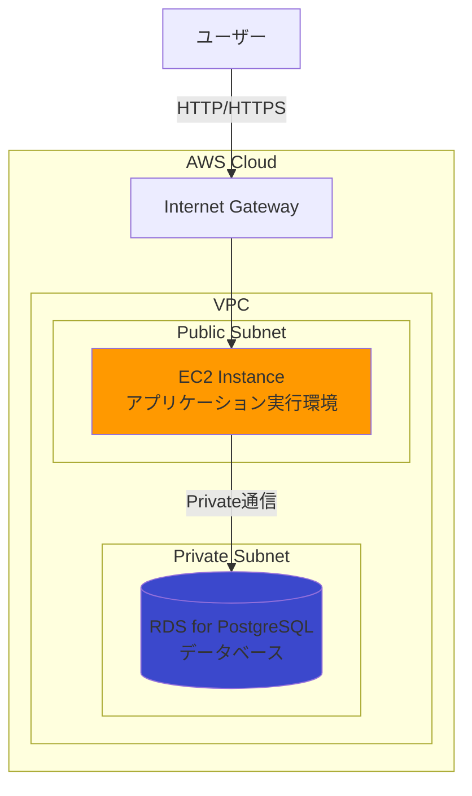
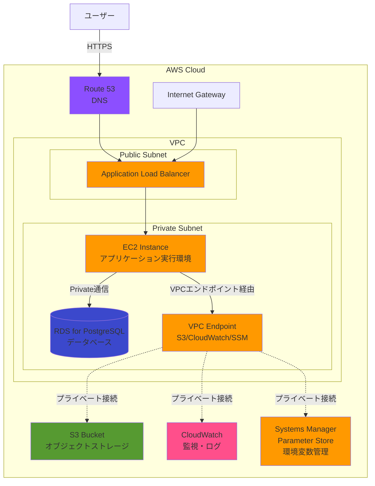

# 本番インフラアーキテクチャ

## 概要

本ドキュメントでは、本番環境におけるインフラアーキテクチャの設計方針を定義します。

### 設計思想

1. **最小構成からスタート**: 初期コストを抑え、トラフィック増加に応じて段階的にスケーリング
2. **保守性重視**: 開発環境で構築済みのPM2統合運用を継続し、シンプルなデプロイメントを実現
3. **開発環境との整合性**: 開発環境（Docker + PostgreSQL）との技術スタック統一
4. **AWS無料枠の活用**: 初期運用コストを最小化
5. **将来への拡張性**: コンテナ化により、ECS Fargateへの移行パスを確保

### 本番環境の目的

- アプリケーションの安定稼働とデータの永続化
- 段階的な機能拡張とスケーリング

## アーキテクチャ構成図

### Phase 1（初期構成）: 最小構成

EC2とRDS for PostgreSQLのみでアプリケーションを稼働させる最小構成。

### Phase 2（将来構成）: Private Subnet + ALB

トラフィック増加時にALBを導入し、EC2をPrivate Subnetに移行する構成。

## AWSサービス選定と理由

### 1. アプリケーションホスティング: EC2

#### 選定理由

| 項目            | 理由                                                 |
| --------------- | ---------------------------------------------------- |
| **最小構成**    | 初期コストを抑え、シンプルな構成でスタート           |
| **PM2統合運用** | 開発環境で構築済みのPM2管理をそのまま活用可能        |
| **Docker活用**  | 既存のDocker構成をEC2上で継続運用                    |
| **無料枠活用**  | 新規AWSアカウントで12ヶ月間無料枠を活用              |
| **柔軟性**      | インスタンスタイプの変更が容易（トラフィック増加時） |

#### 代替案との比較

| サービス    | メリット                          | デメリット            | 選定結果            |
| ----------- | --------------------------------- | --------------------- | ------------------- |
| **EC2**     | 柔軟性高、無料枠活用、PM2統合運用 | サーバー管理必要      | ✅ 採用（初期構成） |
| ECS Fargate | サーバーレス、スケーラブル        | コスト高（$30-40/月） | 将来移行            |
| App Runner  | 簡単デプロイ                      | PM2統合困難           | 不採用              |

### 2. データベース: RDS for PostgreSQL

#### 選定理由

| 項目                   | 理由                                                    |
| ---------------------- | ------------------------------------------------------- |
| **開発環境との整合性** | 開発環境でPostgreSQLを使用                              |
| **ORM統合**            | Drizzle ORMでマイグレーション・スキーマ管理が構築済み   |
| **マネージドサービス** | バックアップ、パッチ適用、モニタリングをAWSが自動管理   |
| **無料枠活用**         | ARM Graviton2ベースのインスタンスで12ヶ月間無料枠を活用 |
| **移行コストゼロ**     | 開発環境のスキーマをそのまま利用                        |

### 3. ストレージ: S3

#### 選定理由

| 項目             | 理由                                              |
| ---------------- | ------------------------------------------------- |
| **スケーラブル** | 容量無制限、トラフィック増加に自動対応            |
| **高可用性**     | 99.999999999%（11 9's）の耐久性                   |
| **低コスト**     | 従量課金、初期段階は数ドル/月                     |
| **セキュリティ** | IAMポリシーとバケットポリシーで細かいアクセス制御 |

- **用途**: アプリケーションで使用するファイルの保存

### 4. DNS: Route 53

#### 選定理由

- **AWSサービス統合**: EC2、ALBとのシームレスな連携
- **高可用性**: 100% SLAの保証
- **ヘルスチェック**: エンドポイント監視とフェイルオーバー対応

### 5. 監視・ログ: CloudWatch

#### 監視項目

**アプリケーション**:

- CPU使用率、メモリ使用率、ディスク使用率
- ネットワークトラフィック

**データベース**:

- CPU使用率、データベース接続数
- 空きストレージ

**ストレージ**:

- ストレージ使用量、リクエスト数

#### ログ収集方針

- アプリケーションログをCloudWatch Logsに集約
- ログ保持期間: 30日間（コスト最適化）
- エラーログの閾値超過時にSNS通知

### 6. シークレット管理: AWS Systems Manager Parameter Store

#### 選定理由

- 既存設計の活用（`docs/04_infrastructure/06_parameter_store_setup.md`で設計済み）
- 無料枠（10,000パラメータまで無料）
- IAM統合で安全にアクセス

## ネットワーク設計

### VPC構成

**VPC**: プライベートネットワーク空間を定義

**Phase 1（Public Subnet構成）**:

- **Public Subnet**: EC2を配置、インターネットゲートウェイ経由でアクセス可能
- **Private Subnet**: RDSを配置、外部からの直接アクセスを遮断

**Phase 2（Private Subnet + ALB構成）**:

- **Public Subnet**: ALBを配置
- **Private Subnet**: EC2とRDSを配置、VPCエンドポイント経由でAWSサービスにアクセス

**ルーティング**:

- Public SubnetはInternet Gatewayへのルートを設定
- Private SubnetはVPCエンドポイント経由でAWSサービスにアクセス（インターネットへの外向き通信なし）

**VPCエンドポイント（Phase 2で導入）**:

- **S3 Gateway Endpoint**: ストレージへのプライベートアクセス（無料）
- **CloudWatch Logs Interface Endpoint**: ログ送信用
- **Systems Manager Interface Endpoint**: Parameter Storeアクセス用

### VPCエンドポイント設計（Phase 2）

**Gateway Endpoint**:

| サービス | タイプ  | 用途                     |
| -------- | ------- | ------------------------ |
| **S3**   | Gateway | 画像ファイルの保存・取得 |

**Interface Endpoint**:

| サービス            | タイプ    | 用途                              |
| ------------------- | --------- | --------------------------------- |
| **CloudWatch Logs** | Interface | アプリケーションログの送信        |
| **Systems Manager** | Interface | Parameter Storeからの環境変数取得 |

**設計のポイント**:

- すべてのAWSサービスへの通信がVPC内で完結し、セキュリティが向上

## IaCツール選定

### 推奨: AWS CDK (TypeScript)

#### 選定理由

| 項目                      | 理由                                                 |
| ------------------------- | ---------------------------------------------------- |
| **TypeScript統合**        | プロジェクトの技術スタック（TypeScript）と完全に統一 |
| **プログラマブル**        | 条件分岐、ループ、変数を使った柔軟なインフラ定義     |
| **型安全性**              | TypeScriptの型チェックでIaCコードの品質向上          |
| **AWSベストプラクティス** | L2/L3コンストラクトで推奨設定が自動適用              |
| **コード再利用**          | コンポーネント化でインフラパターンの再利用が容易     |

#### 代替案との比較

| ツール             | メリット                               | デメリット                           |
| ------------------ | -------------------------------------- | ------------------------------------ |
| **AWS CDK**        | TypeScript統合、型安全、プログラマブル | AWSのみ対応                          |
| **Terraform**      | マルチクラウド対応、豊富なプロバイダー | HCL言語の学習コスト、型安全性なし    |
| **CloudFormation** | AWS公式、追加コストなし                | JSONまたはYAML記述、冗長、再利用性低 |

#### プロジェクト構成方針

- スタック分離（Network, Database, Compute, Storage, Monitoring）
- 環境別の設定管理（development, test, production）
- 再利用可能なコンストラクトの作成

## デプロイ戦略

### CI/CDパイプライン

#### デプロイフロー

1. **ビルド & テスト**: コード品質チェック、ユニットテスト、統合テスト
2. **Dockerイメージビルド**: すべての依存関係を含むDockerイメージをビルド
3. **イメージプッシュ**: ビルド済みイメージをコンテナレジストリ（ECR）にプッシュ
4. **デプロイ**: EC2でイメージをpullして起動
5. **ヘルスチェック**: アプリケーションの正常性確認

#### ビルド済みイメージ方式の採用

**Phase 2でNAT Gatewayを不要にするため、以下の方針を採用**:

- **GitHub Actions上でビルド**: npm install等の依存関係インストールはCI/CD環境で実施
- **完全なイメージ**: すべての依存関係、アプリケーションコード、環境設定を含むDockerイメージを作成
- **EC2での作業**: イメージのpullと起動のみ（インターネットへの外向き通信不要）
- **更新戦略**: パッケージ更新もGitHub Actions上で実施し、新しいイメージをデプロイ

**メリット**:

- NAT Gateway不要
- デプロイの一貫性向上（イミュータブルデプロイ）
- ロールバックが容易（前バージョンのイメージに戻すだけ）

#### 自動化ツール

- **GitHub Actions**: コードpush時の自動ビルド・デプロイ
- **Amazon ECR**: Dockerイメージのレジストリ
- **Parameter Store**: 環境変数の一元管理
- **PM2**: プロセス管理と自動再起動

### デプロイ手順

詳細な手順は別途デプロイガイド（`docs/04_infrastructure/02_deployment_guide.md`）で定義

## 監視・ログ戦略

### CloudWatch Alarms設定

**アプリケーション層**:

- CPU使用率80%以上でアラート
- ディスク使用率85%以上でアラート
- ステータスチェック失敗時に自動リカバリー

**データベース層**:

- CPU使用率80%以上でアラート
- データベース接続数が最大接続数の80%以上でアラート
- 空きストレージ5GB以下でアラート

**アプリケーションログ**:

- エラーログが閾値超過時にアラート

### ログ分析

- CloudWatch Logs Insightsでログクエリ実行
- エラーログ集計、APIレスポンスタイム分析
- 異常検知とトレンド分析

## 将来の拡張計画

### Phase 2: 中規模トラフィック対応（100-500ユーザー）

**アプリケーション層の拡張**:

- Application Load Balancer (ALB)導入
- Auto Scaling設定（CPU使用率70%以上でスケールアウト）
- 最小インスタンス数: 2、最大: 4

**データベース層の拡張**:

- Multi-AZ構成への移行（自動フェイルオーバー）
- Read Replica導入（読み取り負荷分散）

### Phase 3: ECS Fargateへの移行（500ユーザー以上）

**コンテナオーケストレーション**:

- ECS Fargateクラスター構築（サーバーレスコンテナ管理）
- タスク定義でPM2統合運用を継続
- ALBとの統合

### Phase 4: マネージドサービスへの移行検討

**データベース**:

- Aurora PostgreSQL Serverless v2（自動スケーリング、コスト最適化）

**フロントエンド**:

- CloudFront + S3（Nuxt.jsを静的生成に移行、グローバル配信）

**認証**:

- Amazon Cognito（ユーザー認証・認可の管理、OAuth2.0統合）

## 構築手順の概要

実際の構築作業は、次のIssueで以下の順序で実施：

1. AWS CDKプロジェクト初期化
2. VPCとネットワーク構築
3. RDS for PostgreSQL構築
4. EC2インスタンス構築とアプリケーションデプロイ
5. ストレージ構築と統合
6. CI/CDパイプライン構築
7. 監視・アラート設定

## まとめ

本ドキュメントでは、本番インフラアーキテクチャとして以下を選定・設計しました：

### 選定サービス

| カテゴリ         | サービス                 | 理由                                   |
| ---------------- | ------------------------ | -------------------------------------- |
| アプリケーション | **EC2**                  | 最小構成、PM2統合運用、無料枠活用      |
| データベース     | **RDS for PostgreSQL**   | 開発環境との整合性、ORM統合済み        |
| ストレージ       | **S3**                   | スケーラブル、低コスト、高可用性       |
| DNS              | **Route 53**             | AWS統合、高可用性                      |
| 監視・ログ       | **CloudWatch**           | AWS統合、アラート設定                  |
| シークレット管理 | **Parameter Store**      | 既存設計活用、無料枠                   |
| IaCツール        | **AWS CDK (TypeScript)** | TypeScript統合、型安全、プログラマブル |

### 拡張計画

- **Phase 2**: ALB + Auto Scaling（中規模トラフィック対応）
- **Phase 3**: ECS Fargate移行（大規模トラフィック対応）
- **Phase 4**: Aurora Serverless v2、CloudFront統合

詳細な実装手順は、次のIssueで段階的に実施します。
